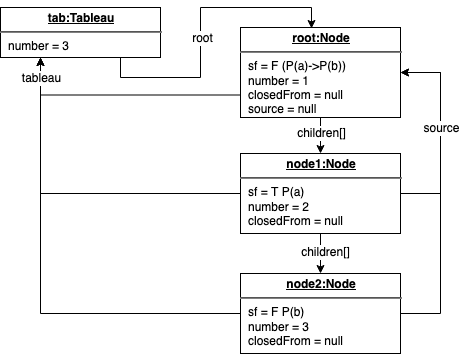

Cvičenie 5
==========

**Riešenie odovzdávajte podľa
[pokynov na konci tohoto zadania](#technické-detaily-riešenia)
do štvrtka 23.3. 23:59:59.**

Či ste správne vytvorili pull request si môžete overiť
v [tomto zozname PR pre pu05](https://github.com/pulls?utf8=%E2%9C%93&q=is%3Aopen+is%3Apr+user%3AFMFI-UK-1-AIN-412+base%3Apu05).

Súbory potrebné pre toto cvičenie si môžete stiahnuť ako jeden zip
[`pu05.zip`](https://github.com/FMFI-UK-1-AIN-412/lpi/archive/pu05.zip).

Tablo
-----

Implementujte _tablové pravidlá_.

Vaše riešenie sa má skladať z dvoch častí:

1. Do tried na reprezentáciu formúl z [cvičenia 3](../pu03/) doimplementujte
   metódy `signedSubf` a `signedType`, ktoré reprezentujú informácie
   o tablových pravidlách pre jednotlivé typy formúl.
2. Do triedy `Tableau` doimplementujte:
   * metódu `addInitial`, ktorá inicializuje tablo danými označenými formulami.
   * metódy `extendAlpha` a `extendBeta`, ktoré implementujú priame rozšírenie
      tabla pravidlami &alpha; a &beta;.

### Označené formuly a tablové pravidlá

Označené formuly reprezentujeme triedou `SignedFormula` z modulu
[`Tableau.java`](pu05-java/Tableau.java). Pri ich vyrábaní môžete použiť buď
konštruktor, ktorý očakáva znamienko (`True` alebo `False`) a formulu,
alebo pomocné statické metódy `T` a `F`, ktoré očakávajú iba formulu.
Na vytvorenie opačnej formuly voči danej označenej formule môžete použiť metódu
`neg`:

```java
Formula f = new Conjunction( new Formula[] {
  new Variable("a"), new Variable("b")
} );

SignedFormula tf = new SignedFormula(true, f);  // T (a∧b)
              tf = SignedFormula.T(f);          // to isté

SignedFormula ff = new SignedFormula(false, f); // F (a∧b)
              ff = SignedFormula.F(f);          // to isté
              ff = tf.neg();                    // to isté
```

Metóda `signedType(sign)` vráti akého typu (&alpha; alebo &beta;) by dotyčná
formula bola, ak by bola označená značkou `sign` (negácia a premenná sú vždy
typu &alpha;).

Metóda `signedSubf` vráti „podformuly“ označenej formuly,
t.j. &alpha;<sub>1</sub> a &alpha;<sub>2</sub>, ak by bola typu &alpha;,
a &beta;<sub>1</sub> a &beta;<sub>2</sub>, ak by bola typu &beta;.

Pamätajte, že konjukcia a disjunkcia môžu mať viacero podformúl, takže
tablové pravidlá v skutočnosti vyzerajú nasledovne:

```
  T A1 ∧ A2 ∧ A3 ∧ ... ∧ An           F A1 ∧ A2 ∧ A3 ∧ ... ∧ An
 ───────────────────────────      ──────┬──────┬──────┬─────┬──────
           T A1                    F A1 │ F A2 │ F A3 │ ... │ F An
           T A2
           T A3
           ...
           T An
```
Ekvivalencia je konjunkcia dvoch implikácií ((<var>A</var> ↔︎ <var>B</var>) je
skratkou za ((<var>A</var> → <var>B</var>) ∧ (<var>B</var> → <var>A</var>)),
takže pravidlá pre ňu vyzerajú podobne ako pre konjunkciu, len podformuly majú
trošku zložitejší tvar:

```
 T A↔︎B             F A↔︎B
───────       ───────┬───────
 T A→B         F A→B │ F B→A
 T B→A
```

### Tablo

Tablo reprezentujeme ako strom vytvorený z objektov triedy `Node`
definovanej v knižnici [`Tableau.java`](pu05-java/Tableau.java).

Pri vytváraní ďalších uzlov tabla potom treba vždy ako druhý parameter  (<var>`source`</var>) konštruktora `Node` uviesť referenciu na uzol so
zdrojovou formulou, z ktorej vznikla formula nového uzla aplikáciou nejakého
pravidla.

Na správne vloženie uzla do tabla treba
  1. zaradiť ho medzi deti rodičovského uzla (``Node::addChild``), ak uzol
    má rodiča, alebo nastaviť ho ako koreň tabla, ak uzol rodiča nemá
    (atribút `root` tabla),
  2. nastaviť uzlu tablo, ktorému patrí a jeho číslo v ňom
    (`Node::addToTableau`); naposledy použité číslo uzla si tablo pamätá
    v atribúte `number`.

Pretože tieto kroky budeme potrebovať na viacerých miestach, najlepšie
bude, keď ich implementujete v pomocnej metóde

```java
private void addNode(Node parent, Node node)
```

Jednoduchý príklad manuálneho vytvorenia tabla a výsledné tablo:

```java
static Constant C(String c) { return new Constant(c); }
static PredicateAtom PA(String p, Constant... ts) {
  return new PredicateAtom(p, Arrays.asList(ts));
}
...
Tableau tab = new Tableau();

// Vytvoríme koreňový uzol s označenou formulou zo vstupnej množiny (null)
Node root = new Node(
    SignedFormula.F(
        new Implication( PA("P", C("a")), PA("P", C("b")) )
    ),
    null
);
// Pridáme ho do tabla (null – uzol bez rodiča, addNode ho nastaví ako koreň)
tab.addNode(null, root);

// Vytvoríme uzol s 1. formulou odvodenou z koreňovej
Node node1 = new Node( SignedFormula.T( PA("P", C("a")) ), root );
// Pridáme ho do tabla ako dieťa koreňa
tab.addNode(root, node1);

// Vytvoríme uzol s 2. formulou odvodenou z koreňovej
Node node2 = new Node( SignedFormula.F( PA("P", C("b")) ), root );
// Pridáme ho do tabla ako dieťa node1
tab.addNode(node1, node2);

System.out.println(tab);
```

```
(1) F (P(a)->P(b))
==================
  (2) T P(a) (1)  
  (3) F P(b) (1)  
```



### Inicializácia tabla

Inicializácia tabla nejakou množinou označených formúl je úlohou metódy

```java
public List<Node> addInitial(SignedFormula[] sfs)
```

Pre vstupné označené formuly postupne vytvorí a vloží do tabla uzly. Uzol
pre prvú formulu sa stane koreňom tabla. Uzol pre každú ďalšiu formulu sa
stane dieťaťom uzla pre predchádzajúcu formulu. Metóda vráti zoznam
všetkých nových uzlov. Na samotné vloženie nového uzla do tabla využite
pomocnú metódu `addNode`, ktorú sme vysvetlili vyššie.

### Rozšírenie tabla

Na priame rozšírenie tabla pravidlami &alpha; a &beta; naimplementujte
metódy `Tableau::extendAlpha` a `Tableau::extendBeta`.

Metóda
```java
public Node extendAlpha(Node leaf, Node from, int index)
```
rozšíri tablo pravidlom &alpha;. Vytvorí nový uzol, ktorý bude dieťaťom
listu <var>`leaf`</var>. Na rozšírenie použije formulu typu &alpha; zo
zdrojového uzla <var>`from`</var>. Do nového uzla vloží jej priamu označenú
podformulu s číslom <var>`index`</var>. Metóda vráti nový uzol.

Metóda
```java
public List<Node> extendBeta(Node leaf, Node from)
```
rozšíri tablo pravidlom &beta;. Vytvorí nové uzly pre všetky označené priame
podformuly formuly zo zdrojového uzla <var>`from`</var>. Priradí ich ako
deti listu <var>`leaf`</var>. Metóda vráti zoznam nových uzlov.

Nemusíte kontrolovať, či je formula v zdrojovom uzle správneho typu. Na
samotné vloženie nového uzla do tabla využite pomocnú metódu
`addNode`, ktorú sme vysvetlili vyššie.

Po implementovaní metód `addInitial`, `extendAlpha`, `extendBeta` sa
tablo dá vyrobiť napríklad takto:

```java
Tableau tab = new Tableau();
List<Node> initial = tab.addInitial( new SignedFormula[] {
    SignedFormula.F(
        new Implication(
            new Disjunction( new Formula[] {
                PA("P", C("a")),
                PA("P", C("b"))
            } ),
            PA("P", C("b")) ) )
} );
Node node1 = initial.get(0); // koreň
Node node2 = tab.extendAlpha(node1, node1, 0);
Node node3 = tab.extendAlpha(node2, node1, 1);
List<Node> nodes45 = tab.extendBeta(node3, node2);

System.out.println(tab);
```

```
   (1) F ((P(a)|P(b))->P(b))   
===============================
     (2) T (P(a)|P(b)) (1)     
        (3) F P(b) (1)         
-------------------------------
(4) T P(a) (2) | (5) T P(b) (2)
```

## Technické detaily riešenia

Riešenie odovzdajte do vetvy `pu05` v adresári `prakticke/pu05`.
Odovzdávajte (modifikujte) súbory
[`pu05-java/Formula.java`](pu05-java/Formula.java)
a [`pu05-java/Tableau.java`](pu05-java/Tableau.java).
Program [`pu05-java/TableauTest.java`](pu05-java/TableauTest.java) musí korektne
zbehnúť s vašou knižnicou.

Odovzdávanie riešení v iných jazykoch konzultujte s cvičiacimi.
